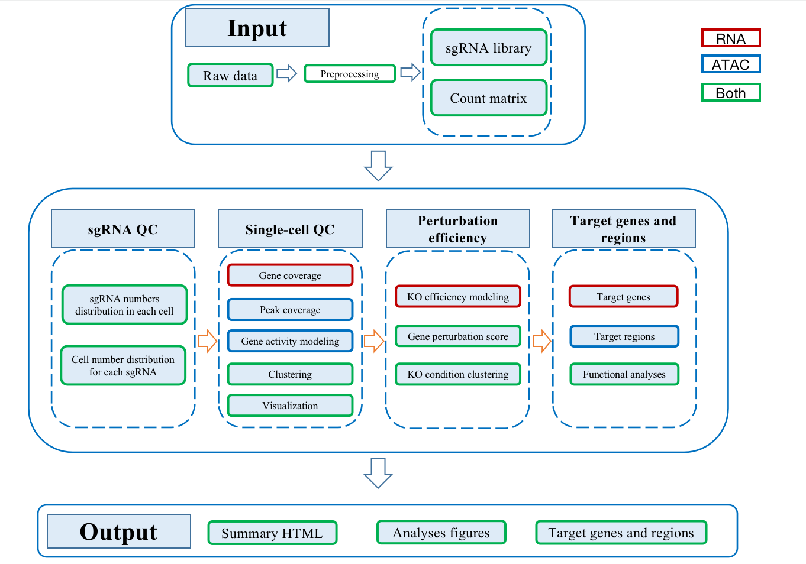

# SCREEN
<strong>SCREEN</strong>(<strong>S</strong>ingle-cell <strong>C</strong>RISPR sc<strong>RE</strong>en data analyses and p<strong>E</strong>rturbation modeli<strong>N</strong>g) is a pipeline to visualize the quality of single-cell CRISPR screens RNA-seq/ATAC-seq datasets. SCREEN has integrated three R functions: scMAGeCK_lr, Mixscape and plot function of cicero. These functions are used to estimate the regulatory score between perturbations and genes, estimate the perturbation efficiency and visualize enhancer regulatory potential, respectively. 

</img>

## Document
We are hosting SCREEN documentation, instruction and tutorials at <a href="https://hailinwei98.github.io/SCREEN.html">SCREEN Website</a>.

## Dependency
	R >= 4.0.3
	Seurat >= 4.0.3
	scMAGeCK
	snakemake
	mixtools

## Installation
	$ R
	> library(devtools)
	> install_github("HailinWei98/SCREEN")
